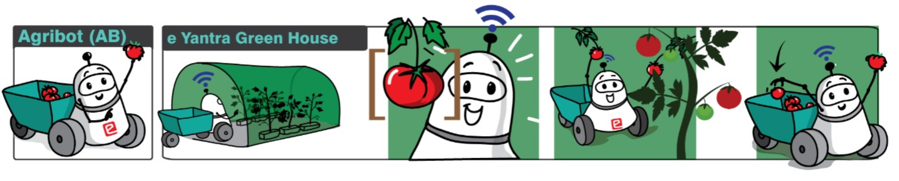

# AgriBot



AgriBot is one of the themes in 10th edition of [E-Yantra Robotics Competition](https://portal.e-yantra.org/) 2021-2022 , an international robotics outreach program funded by the Ministry of Education and hosted at the [Indian Institute of Technology, Bombay](https://www.iitbombay.org/)

This repository explains our approach to the tasks for the AgriBot theme. 

Our team consisting of 3 members(myself Team Leader) from the Father Conceicao Rodrigues College of Engineering,Bandra has secured an overall 12th position among 255 international teams in the theme. 

## Theme description
Commercial harvesting necessitates expert labour. The picker must swiftly identify any ripe tomatoes on a plant, select them,pick and place them into basket all at the same time. This is labour for the employees as well as bad for the farm's overall efficiency. 

The aim is to train an AgriBot for picking tomatoes from a greenhouse environment and placing them into its basket. A total of 6 incremental tasks starting from the installation to the final solution to the problem are detailed here.

## Software Specifications
We will use Gazebo simulator, a robotics simulator, where the simulated greenhouse and Agribot will dwell, the MoveIt Motion Planning Framework for controlling the Robotic Arm, and ROS for integrating the many parts of autonomy required in the solution.
### 1. [Ubuntu 20.04 LTS](https://releases.ubuntu.com/20.04/)
- Ubuntu 20.04, a Linux environment is used for running all the packages and programmes such as Gazebo 11 etc.

### 2. [ROS Noetic](http://wiki.ros.org/noetic)
- The Robot Operating System (ROS) is a set of software libraries and tools that help one build robot applications.
 **Note:** ROS is strongly version specific middleware. Thus, Ubuntu 20.04 (Focal) is used with ROS Noetic.

### 3. [Gazebo](https://gazebosim.org/home)
- Gazebo 11, a physical engine (used for simulation) is tightly integrated with ROS Noetic and so it comes pre-installed when      ```ros-noetic-desktop-full``` is installed.

### 4. [MoveIt](https://moveit.ros.org/)
- MoveIt is an open-source robotic manipulation platform that allows you to develop complex manipulation applications using ROS.
- It is a free-space motion planning framework for ROS.

### 5. [Rviz](http://wiki.ros.org/rviz/UserGuide#Move_Camera_.28Keyboard_shortcut:_m.29)
- rviz (short for “ROS visualization”) is a 3D visualization software tool for robots, sensors, and algorithms. 
- It uses sensor data to try to create an accurate depiction of what is going on in the robot’s environment..

### 6. [Python3](https://www.python.org/download/releases/3.0/)
- All the programs interfacing with ROS Noetic framework are written in Python3. 
- It comes preinstalled with ROS Noetic.


## Tasks
For each task package, README files are provided which give details about the problem statement and the task specifications. 
The video/image solutions are also added in the README files.
- [Task 0 - Getting familiar with ROS and Ubuntu](task_0/README.md)
- [Task 1 - ROS navigation in the green house environment](task_1)
- [Task 2 - Getting started with Arm Manipulation (Forward kinematics)](task_2)
- [Task 3.1 - Detection and Extraction of tomato pose co-ordinates and broadcasting them in Rviz ](task_3_1)
- [Task 3.2 - Autonomous Detection and performing Pick and Place with Robotic Arm (Inverse Kinematics)](task_3_2)
- [Task 4 - Pick and Place Using Multiple Drones](task_4/)
- [Task 5 - Theme Implementation](task_5)
- [Task 6 - Final Theme Implementation](task_6)
## Flow
The competition was carried out in a step-wise manner. The whole theme implementation was divided into several subtasks and then the algorithms and techniques of individual tasks were to be skillfully merged to accomplish the Final Task. I have tried to explain our preparation,approach and implementation in each of the individual tasks properly. Its my request to read this entire repo to get the complete feel of our work. Hope its joyful!

## Task 0
The aim of this task is to get you started with installation of required software components like ROS Melodic and Gazebo. An small assignment was given to get hands-on ROS and other tools.


## Task 1 - Autonomous Navigation in the GreenHouse
The aim of this task is to make the AgriBot move in the Entire GreenHouse Environment in the shortest time possible. 
A LIDAR sensor is present in the Agribot vehicle at its center. With the help of LIDAR sensor data, we programmed our Agribot to navigate properly without collisions with the troughs. We incorporated smooth turnings at endpoints to save on time.Rospy was mainly used as the programming language including other python libraries.

  


  
